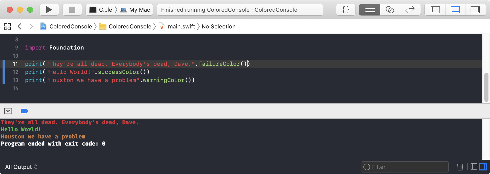
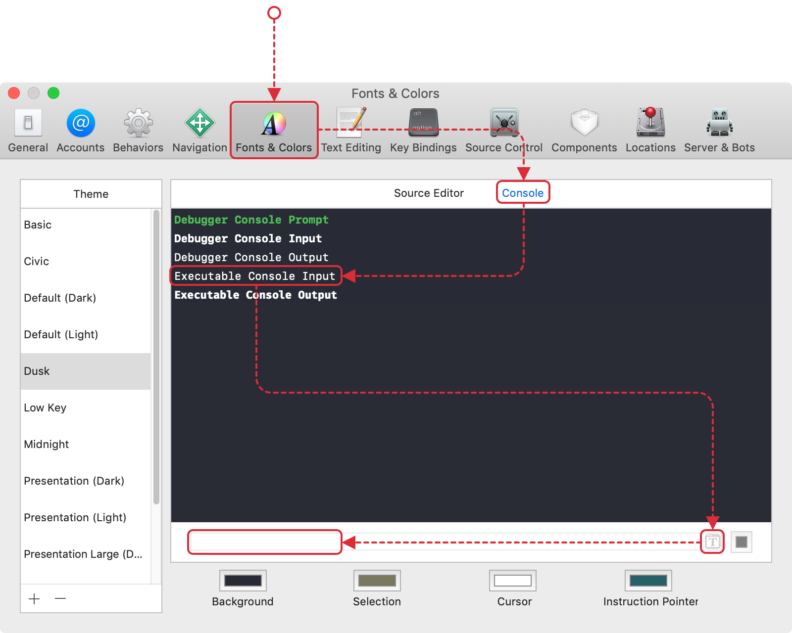

# Colored Console

This project reenables colors in Xcode's console (with a limited palette). Just like this:

## Installation

1. Add the font file named [`ColoredConsole-Bold.ttf`](ColoredConsole-Bold.ttf) in the repo via the Mac OS application [Font Book](https://en.wikipedia.org/wiki/Font_Book).
2. Back to Xcode. Go to "Preference" &#8674; "Texts & Colors" &#8674; "Executable console Output", click the font icon below, then set font to "Colored Console Bold"

## How it works

It's been nearly 3 years since the issue "[Xcode 8 kills code colors](https://github.com/robbiehanson/XcodeColors/issues/88)" was raised on the venerable [XcodeColors](https://github.com/robbiehanson/XcodeColors) project. Since then we've been limited to using emojis to add color to our console.

Recently I wondered, has the answer been staring us in the face all that time. While Xcode doesn't allow styled text, it does respect colored glyphes such as 😊. That very ticket makes a bunch of suggestions for using them in the console.

`ColoredConsole-Bold` is a font, based on [FiraMono-Bold](http://mozilla.github.io/Fira/) which adds ligatures for enabling colored variants of the ASCII character set. Here's the default color range:

The 5 colors are enabled by suffixing the character with one of the [Variation Selectors](https://en.wikipedia.org/wiki/Variation_Selectors_(Unicode_block)) 6-10 (FE06, FE07, FE08, FE09 and FE0A).

## Changing the colors

You can have different colors and modifier codepoints by changing and running `./colorify.pl`.  I have not documented this (yet).